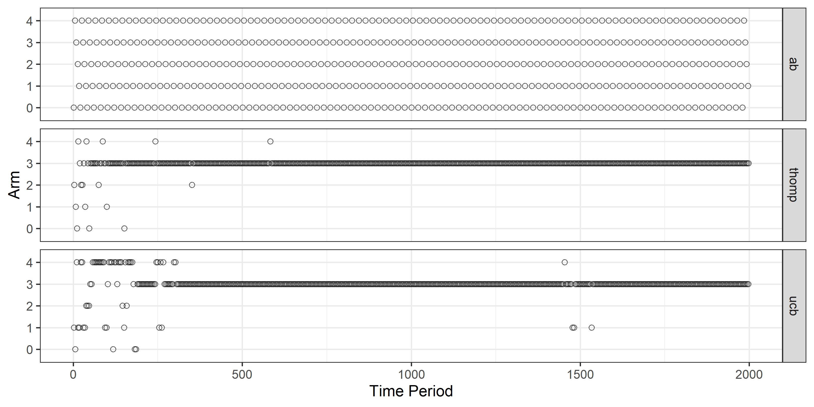
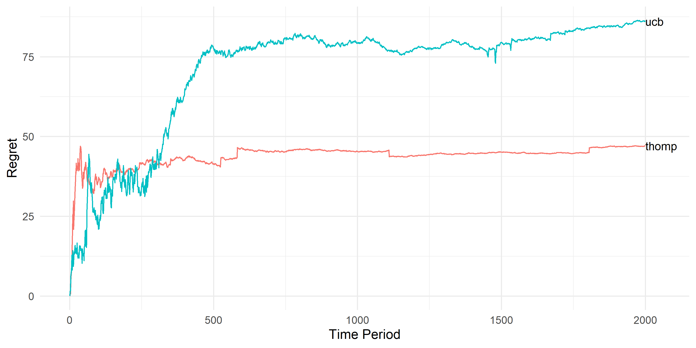
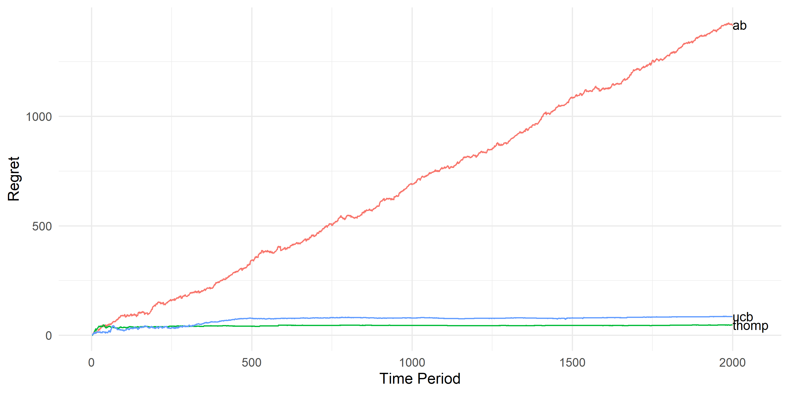

Thompson Sampling is one of the most popular Multi-Armed bandit (MAB) algorithms - the main reason being its explainability (imagine explaining upper confidence bound to your manager) and decent performance in practice [1].

Many blog posts on the Internet show how to implement Thompson sampling ([here](https://visualstudiomagazine.com/articles/2019/06/01/thompson-sampling.aspx), [here](https://towardsdatascience.com/hompson-sampling-for-multi-armed-bandit-problems-part-1-b750cbbdad34), [here](https://peterroelants.github.io/posts/multi-armed-bandit-implementation/) and [here](https://medium.com/analytics-vidhya/multi-armed-bandit-analysis-of-thompson-sampling-algorithm-6375271f40d1)). Almost all of them consider Bernoulli outcome distribution (e.g. click or no click, purchase, or no purchase) and use the Beta-Bernoulli Bayesian update procedure for simulations and usually compare the performance (Regret) to other MAB algorithms like UCB or sometimes to A/B testing. However, none of them consider Gaussian outcome distribution and especially the case when both mean and variance of the distributions are unknown (which is usually the case when you are conducting an experiment where the outcome is continuous, ex: dollars spent, time spent, etc.).

In this post, I address this gap and also compare Thompson Sampling's performance to UCB, and A/B Testing. Questions like - What are MAB's? Why A/B testing? Why Thompson Sampling? and terminology related to MAB are outside the scope of this post.

### Bayesian Update procedure for Normal-Inverse Gamma prior

Before we get into the actual Thompson Sampling Algorithm, we need to understand how to estimate parameters of a normal distribution. Let's consider a random process where outcomes $x_i$ are drawn from $\mathcal{N}(\mu, \sigma^2)$ where $\mu, \sigma^2$ are unknown. As we do not know both these parameters, like a true Bayesian, we put a prior on both. We then keep updating these priors using the Bayes rule as we see more and more data and use the final posterior as the best available approximation for the parameters we are interested in. We could choose any prior distributions for these parameters based on our beliefs of what they could be, but to make our life easier, we choose conjugate priors to get a closed-form analytical solution for the bayesian update procedure.

In this specific case, we assume that $\sigma^2$ follows inverse-gamma distribution and $\mu$ follows Normal distribution. To make the math easy, we use $\tau = \frac{1}{\sigma^2}$ instead of  $\sigma^2$ from now on ($\tau$ is called precision). If $\sigma^2$ follows an Inverse-Gamma distribution, then  $\tau = \frac{1}{\sigma^2}$ follows a Gamma distribution.

$$
\tau \sim Ga(\alpha_0, \beta_0) $$
$$\mu |\tau \sim N(\mu_0, n_0\tau) $$
$$x |\mu, \tau \sim N(\mu, \tau)
$$

We initialize four parameters $\alpha_0, \beta_0, \mu_0$, $n_0$(can be 1), draw $\tau$ from $Ga(\alpha_0, \beta_0)$ , use this value of $\tau$ to draw $\mu$ from $N(\mu_0, n_0\tau)$, observe an outcome given out by the actual process (which we assume is drawn from the true distribution - the mean and variance of which we are trying to estimate), and update the four parameters using this outcome value to get the posterior. The update procedure is below. Note that this will work for either a single outcome drawn or a bunch of outcomes drawn at the same time.

$$
\alpha = \alpha_0 + \frac{n}{2} $$
$$\beta = \beta_0 + \frac{1}{2}\sum(x_i - \bar{x})^2 + \frac{nn_0}{2(n+n_0)(\bar{x}-\mu_0)^2} $$
$$n = n_0 + n $$
$$\mu = \frac{n}{n+n_o}\bar{x} + \frac{n_0}{n+n_o}\mu_0 $$

{}
Note that this updation procedure will work for single outcome or a bunch of outcomes. When there is a single outcome, $\alpha = \alpha_0 + 1/2$ , $n = n_0 + 1$, $\bar{x} = x_i$
{}

Once the updation is done, the posteriors follow the following distributions

$$
\mu |\tau, x \sim N(\frac{n}{n+n_0}\bar{x} + \frac{n_0}{n+n_0}\mu_0 , n\tau + n_0\tau) $$
$$ \tau | \mu, x \sim Ga(\alpha_0 + \frac{n}{2} , \beta_0 + \frac{1}{2}\sum(x_i - \bar{x})^2 + \frac{nn_0}{2(n+n_0)(\bar{x}-\mu_0)^2})$$

This Bayesian update procedure follows the basis for the Thompson Sampling algorithm to follow.

### Thompson Sampling

Let's consider there are K arms (treatment groups/variants/choices etc.) available and the outcomes $x_i$ of arm $i$ are drawn from $\mathcal{N}(\mu_i, \sigma_i^2)$ where $\mu_i, \sigma_i^2$ are unknown. The time horizon is $T$. If we knew these parameters, we would pull the arm with the highest mean $T$ times and maximize the expected total output. Because we do not know the parameters, the idea is to find a procedure to pull the arms in such a way so that we have a good understanding of what the true means are without pulling the arms with a low mean a lot of times (minimize the regret).

**Algorithm:**
1. Pull each arm twice
2. For each arm $i$, initialize prior params ($\alpha_{0i} = 0.5, \beta_{0i} = 0.5, \mu_{0i}=\bar{x_i}, n_{0i}=2$ ).
3. At each time-step $t$ until $T$
     1. For each arm $i$,  draw $\tau_i \sim Ga(\alpha_i, \beta_i)$ and  $\mu_i  \sim N(\mu_i, n_i\tau_i)$
     2. For each arm $i$,  draw $x_i \sim N(\mu_i, \tau_i)$
     3. Pull the arm with maximum value of $x_i$ and observe $\mathtt{x}$
     4. Update the priors of the pulled arm using the Bayesian update procedure.

{}
The Choice of priors for alpha and beta is a blog post altogether and I would not delve into it in this post.
{}


This is the procedure for the Thompson sampling algorithm when the outcome distribution is Gaussian and both means and variances are unknown. You can refer to the actual python **code [here](https://github.com/sandeepgangarapu/code_for_the_blog/blob/master/thompson_sampling.py)**, however, it has a bunch of unknown classes that I use as part of my MAB framework. But, the core functionality is still there and you can still replicate it with minor changes and use it in your projects.

### Comparison to UCB and A/B Testing

Upper confidence bound (UCB) is one of the most popular and efficient MAB algorithms. It is only just to compare Thompson Sampling's performance to it. Though A/B testing is generally used for Inference and not with an objective to minimize regret, there is growing literature to bridge this gap [2, 3]. So, bench-marking against A/B testing puts efficiency gains of MAB's into perspective.

In this simulation, we consider 5 arms with different means and variances (we don't know these values, but the simulation does). Let's consider a time period of 2000 (We can only pull the arms 2000 times).

```r
true_means = c(0.25, 1.82, 1.48, 2.25, 2)
true_vars = c(2.84,  1.97, 2.62, 1, 2.06)
```

As per the above distributions, arm 0 has the least mean and arm 3 has the highest mean. So a good MAB algorithm will pull arm 3 most of the time and pull arm 0 very rarely. A/B testing pulls all arms uniformly until it can detect the least effect size (I know we cannot know this beforehand and we need to do power analysis, etc., but let's cheat a little). After that, it will only pull the arm with a statistically significant highest mean. We simulate all three algorithms and pull arms based on what the algorithm suggests.



Fig 1 : Arms pulled at different time periods for various algorithms

This figure shows which arm was pulled at different time periods for different algorithms. As you can see A/B Testing could never be completed as the arm pulls were exhausted before it can statistically distinguish the difference between all the arms. Thompson Sampling and UCB we accurately able to identify very quickly that arm 3 is the best and pull it the most. Both performed the best and we need a regret graph to accurately identify which algorithm performed the best.



Figure 2: Regret growth over time for Thompson Sampling and UCB

The regret graph shows that Thompson Sampling performed better than UCB as it was able to decide on the best arm faster than UCB. This is for one simulation and difference seeds might yield different values, but, the overall theme is the same. Also, in this case, the difference is not significant enough to decide one algorithm is better than the other (MAB theory suggests that regret is not just a function of the algorithm but also mean differences between all arms)



Figure 3: Regret growth over time for A/B Testing, Thompson Sampling and UCB

However, compared to A/B testing the difference in regret compared to MAB's is night and day. This is purely because A/B testing has a completely different objective and would not stop random pulling of arms until it is sure that there is a statistically significant difference (I am simplifying things here, but the idea is accurate).

Please write to me [here](https://sandeepgangarapu.com/Contact-f68d458e3ce14976a309e14827288e37) if you want to discuss more about this topic. I will in the future write more posts regarding this topic.

### References:

1. Chapelle, Olivier, and Lihong Li. "An empirical evaluation of thompson sampling." Advances in neural information processing systems. 2011.
2. Hadad, Vitor, et al. "Confidence intervals for policy evaluation in adaptive experiments." arXiv preprint arXiv:1911.02768 (2019).
3. Zhang, Kelly W., Lucas Janson, and Susan A. Murphy. "Inference for Batched Bandits." arXiv preprint arXiv:2002.03217 (2020).
